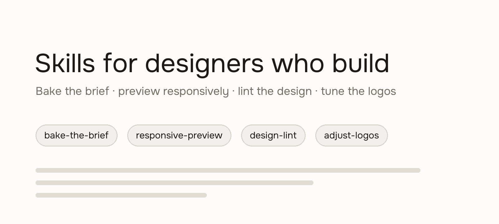

# Skills for designers who build

[](https://skills.sh/iruhdam1/skills)



Agent skills for designers, product managers, and builders shipping with AI.

Agents don't have design judgment. They build a page at 1280 and call it done while it breaks at 390. They'll "clean up" your optically-aligned logo row into a grid that looks worse. And every new session, you re-type the same context you typed yesterday.

These skills bake that judgment — and your context — into the agent.

Built by [Madhuri Maram](https://madhurimaram.com), designing AI-native products since 2024 — most recently as Head of Design & Product at Aampe, an agentic MarTech company acquired by MoEngage. Everything here comes from shipped work: an LLM copy engine taken from ~70% to ~95% first-pass quality, 7+ agent-built tools in customers' hands, and a storefront run solo with agents. The full record is at [madhurimaram.com/work/ai](https://madhurimaram.com/work/ai).

## Install

```bash
npx skills@latest add iruhdam1/skills
```

Or manually: clone this repo and copy the folders inside `skills/` into `~/.claude/skills/` (Claude Code) or your tool's commands folder (Cursor: `.cursor/commands/`).

## Why use it?

You already know what good looks like. The agent doesn't — and it won't tell you when it's guessing. These skills turn taste into checks the agent runs every time: the brief it can't forget, the viewport it forgot to test, the logo row it shouldn't touch.

Your taste, on every run.

## Skills

- **[bake-the-brief](./skills/bake-the-brief/SKILL.md)** — Bake your context into a brief once, and never re-explain it to your agent again. Every session ends with a ledger the next one picks up.
- **[responsive-preview](./skills/responsive-preview/SKILL.md)** — See your page at mobile, tablet, and desktop before you ship it — labeled screenshots and a pass/warn/fail report.
- **[design-lint](./skills/design-lint/SKILL.md)** — ESLint for design. A strict, judged QA pass with a fixed check catalog: layout, spacing, type, tokens, accessibility, responsive.
- **[adjust-logos](./skills/adjust-logos/SKILL.md)** — Align logo rows optically, not mathematically — and stop agents from "fixing" the nudges that make them look right.

More soon.

---

The full Prefix-First Design framework behind bake-the-brief lives at [prefix-first-design](https://github.com/iruhdam1/prefix-first-design). The live side-by-side responsive viewer is at [tinydesignshop.com](https://tinydesignshop.com/tools/responsive-preview/).
