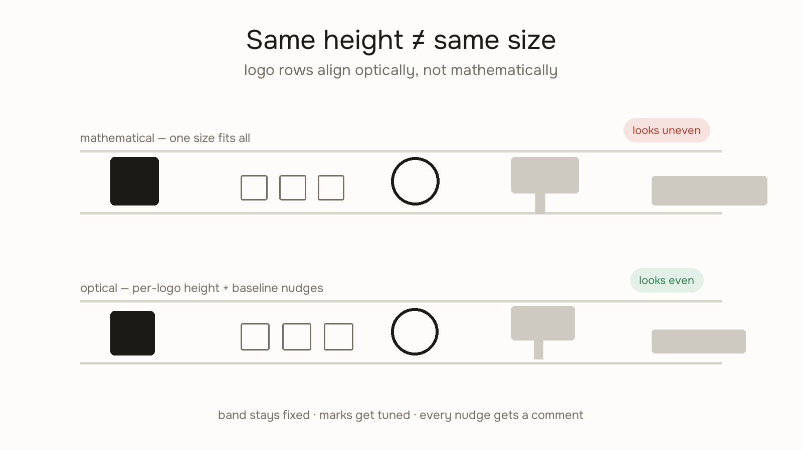

# Adjust Logos



A row of logos set to the same height never *looks* the same height. Wordmarks read heavier than icons, thin marks disappear next to bold ones, and a logo with a descender sits visually lower than its neighbors. Mathematical alignment produces optical chaos — and an agent asked to "clean up" a logo row will make it worse by snapping everything to one height.

Logo rows are aligned **optically, not mathematically**. This skill is the workflow, and the guardrail.

## The band/mark model

- **Band** — the fixed vertical space the row occupies (e.g. 20px). This is the only layout-token value in the system. It never changes per logo.
- **Mark** — each logo inside the band gets its own rendered height (e.g. default 18px within a 20px band), tuned per logo.
- **Tune class** — every deviation from the default lives in a per-logo class (`.logo-row__mark--acme`), with a comment stating the optical reason.

```css
.logo-row { height: 20px; }               /* band — tokenized, fixed */
.logo-row__mark { height: 18px; }          /* default mark */
.logo-row__mark--acme {
  height: 19px;                            /* thin wordmark reads small */
  transform: translateY(-0.5px);           /* baseline sits low */
}
```

## Tuning workflow

1. **Set the band and the default mark.** Most logos should need nothing else.
2. **Eyeball at 100% zoom, at rendered size.** Not zoomed in — optical judgment only works at the size users see.
3. **Tune the outliers, one property at a time:**
   - Reads too small → +1px height (thin or short marks: this plus a slight baseline lift is the usual fix)
   - Sits low/high → `translateY` in sub-pixel or 1px steps
   - Crowds its neighbor → micro `margin-left`, 1–2px
4. **Comment every nudge with the reason.** `/* wordmark x-height reads small next to icon marks */` — the comment is what stops the next person (or agent) from "cleaning it up."
5. **Squint test.** Blur your eyes or step back: the row should read as one even strip. If one logo still pops, tune it, not the others.

## Hard rules — for agents especially

- **Never tokenize optical nudges.** `translateY(-0.5px)`, per-logo heights, and micro-margins are element-first values. Turning them into spacing tokens destroys the information they carry.
- **Never flag optical nudges in a spacing audit.** A raw-px audit that hits a commented per-logo tune class should skip it, not report it. (design-lint's `raw-rhythm-px` check exempts these.)
- **Never equalize heights across mixed-weight marks.** Uniform height is the bug, not the fix.
- **Never center by bounding box.** A logo's visual center is not its box center — descenders, dots, and asymmetric icons all lie.
- **Adding a logo?** Start at the default mark, then tune only if it visibly misbehaves next to its neighbors. Register the tune class beside the others so the row stays auditable in one place.

## When it goes wrong

- **The row was "cleaned up" and now looks uneven** — someone snapped every mark to one height. Restore per-logo tuning; the comments are the spec.
- **One logo keeps getting re-nudged every session** — the reason comment is missing. Write it down where the value lives.
- **The band grew to fit one tall logo** — wrong direction. The band is fixed; scale the mark down into it.
