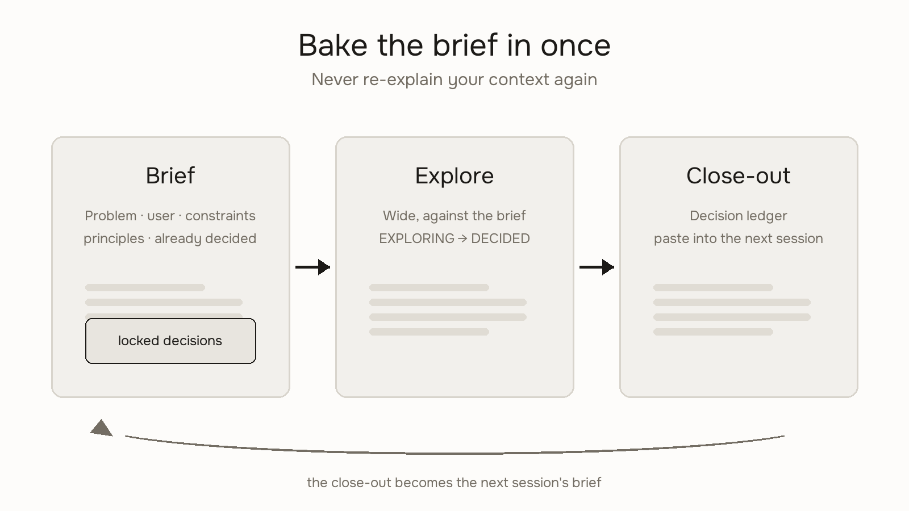

# Bake The Brief



Bake the brief in once. Never re-explain your context again.

Every AI session starts from zero. So you re-type who the user is, what the product does, what you already decided — every single time. And when you forget, the agent happily builds the wrong thing with total confidence.

The fix is a **brief**: a short block of stable context you set once at the top of a session. Everything explored gets tested against it. Everything decided gets locked into it. At the end, a **close-out** carries the decisions to the next session, so no session ever starts from zero again.

Three words to know: the **brief** (your stable base), a **locked decision** (one the next step builds on), the **close-out** (the ledger you carry forward).

## The brief

Fill this in before generating anything. If you can't fill it in, that's the actual problem to solve first.

```
PROBLEM
What can't the user do today? 1–3 sentences. No solution language.

USER
Who is this for, what do they already know, what are they in the middle of doing?
One real detail beats a persona.

CONSTRAINTS
What is genuinely not allowed to change? Hard limits only — technical,
business, scope. "Should feel modern" is a preference, not a constraint.

PRINCIPLES
2–4 max. A principle that couldn't reject any idea is decoration.

ALREADY DECIDED
Locked decisions from earlier sessions that this session builds on.
```

## Instructions for the agent

**1. Read before you build.** If a close-out or brief exists (pasted in, or in the repo), read it first. Mirror the state back in 2–3 plain lines: where things stand, what's locked, what needs the human. Don't draft anything until the brief is held.

**2. Grade the brief — warm roast, not bureaucrat.** One short pass, specific, then move on:

- PROBLEM contains a solution? "A dashboard that shows…" is a feature request wearing a trench coat. Ask what the user can't do today.
- USER is a persona? "Busy professionals" holds nothing. Ask for one real detail.
- CONSTRAINTS are preferences? Keep only what genuinely can't change.
- PRINCIPLES don't filter? Ask: what would this principle say no to?

If two or more fields fail, don't ideate yet — sharpening the brief together is the first deliverable, not a delay. If the brief is solid, say so in one line and start.

**3. Explore wide, against the brief.** Multiple directions, divergent ideas — all tested against the same base. Label everything either **EXPLORING** (being tested) or **DECIDED** (locked, added to the brief). The moment something is decided, lock it: "We've decided X. Lock it into the brief."

**4. A detail change is fine. A different problem is not.** If an implementation detail shifts but still serves the same problem — log it and keep going. If the conversation starts answering a *different* problem or quietly overturns a locked decision — stop. Say exactly what changed: "We started with X; this assumes Y." Make the human choose: update the brief deliberately, or return to it. Never quietly follow the change. Never treat every pixel tweak as a crisis.

**5. Catch re-explaining.** If the human re-explains something already in the brief, flag it: "That's already in the brief — update it or use what's there?" Repeated context means the brief is too vague to hold. Offer to sharpen it.

**6. Close out every session.** Before ending, output this — top half for the human to skim, bottom half for the next agent to follow:

```
## Close-out — [date] — [session goal]

[One short paragraph: what this session did, what's left, recommended
focus next time. Plain English.]

Locked this session:      [decisions the next step builds on]
Explored, not locked:     [do not carry forward as constraints]
Brief changes:            [what changed and why — or "none. It held."]
Open questions:           [for next session]

For the next agent:
1. Read this close-out first. Mirror state in 2–3 lines. Hold the brief.
2. Recommended focus: [one phrase]
3. Fine to do without the human: [items — or none]
4. Needs the human: [items — or none]
```

Paste it as message one of the next session. That's the whole trick: the context is baked in, and it compounds.

## When it goes wrong

- **You re-explained the user in message 4** — the brief was too vague to hold. Sharpen USER, lock it.
- **The exploration quietly changed the problem** — stop, name it, choose: brief update or new session. Either is fine; silent isn't.
- **You handed off the artifact without the context** — a prototype without its problem frame is just a screen. The brief travels with the work.
- **The session got long and coherence dropped** — write the close-out now, open a fresh session, paste it in as the brief.

---

Based on [Prefix-First Design](https://github.com/iruhdam1/prefix-first-design) — the full framework, with the frame pass, page ledgers, and monthly still-holds checks — by [Madhuri Maram](https://madhurimaram.com), built from 15+ shipped AI prototypes. The name comes from prompt caching: the prefix is the part of the context that doesn't change, and changing it means paying full cost again. Same rule, applied to design sessions.
