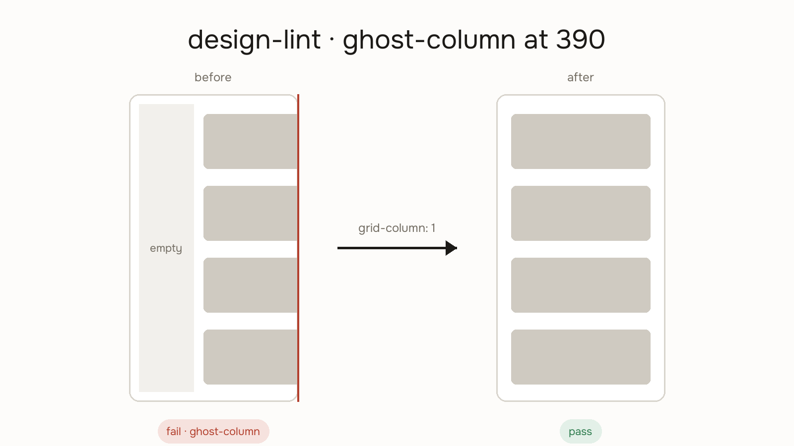

# Design Lint



ESLint for design. Agents ship pages that look right at 1280 and quietly break at 390 — an empty ghost column, metrics spread across dead space, a hero drifting off its grid. Each bug is small; together they're the difference between an interface that feels designed and one that feels generated.

Design lint runs a fixed catalog of checks with severities and reports what it finds. It judges; [responsive-preview](../responsive-preview/SKILL.md) just shows.

## Usage

```
/design-lint [url or path]
```

## Operating posture

- **Strict by default.** Every `fail`-severity check fails the run unless the user documents an intentional opt-out ("intentional — centered metrics on mobile, noted in the page notes"). Default is fail.
- **Evidence, not vibes.** Every finding names the check, the viewport, and what you observed — a selector, a computed value, a screenshot region. No "feels cramped."
- **Read-only.** Lint reports; it does not fix. Offer to fix as a follow-up.

## Workflow

### Phase 1 — Static pass (no browser needed)

Grep the CSS and markup for the static checks in [CHECKS.md](CHECKS.md): raw px in layout rhythm, hex/rgba literals for UI color, orphan font-sizes, missing alt text, heading skips. Record findings before opening a browser — these are the cheapest bugs to catch.

### Phase 2 — Visual pass

1. Open the target URL (if the dev server is down, report the static pass only and say so).
2. Screenshot at **390 × 844**, **820 × 1024**, and **1280 × 900**.
3. Judge each screenshot against the layout, responsive, and accessibility checks in [CHECKS.md](CHECKS.md). Inspect the DOM where a screenshot is ambiguous — overflow and focus states don't always show.

### Phase 3 — Report

Required format, no substitutes:

**Part 1 — Findings table**

| Check | Viewport | Severity | Evidence | Fix |
|---|---|---|---|---|
| ghost-column | 390 | fail | `.split` children keep `grid-column: 2`; content clipped right | reset `display: grid` + `grid-column: 1` ≤720px |

**Part 2 — Verdict**

- Per-viewport status: `390 — fail · 820 — pass · 1280 — warn`
- One line: what must change before this ships, or "Clean. Ship it."

## The check catalog

Six categories, each check tagged `fail` or `warn` — full definitions with symptoms, root causes, and fixes in [CHECKS.md](CHECKS.md):

1. **Layout** — ghost columns, flex spread, label/body axis mismatch, hero width drift, early-wrapping text, horizontal overflow
2. **Spacing** — raw px instead of a scale, inconsistent section gaps, missing scroll-margin
3. **Typography** — off-scale font sizes, sub-13px mobile text, over-long lines, heading hierarchy skips
4. **Color & tokens** — hardcoded hex for UI color, near-duplicate grays, hardcoded dark-mode values
5. **Accessibility** — body-text contrast under WCAG AA, missing focus states, touch targets under 44px, images without alt
6. **Responsive** — nav collapse, fixed elements obscuring content, overflowing or pixelated images

## Tone

Findings are direct and specific — name the selector, name the fix. No hedging, no praise padding. If the page is clean, one line says so.
