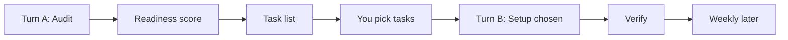
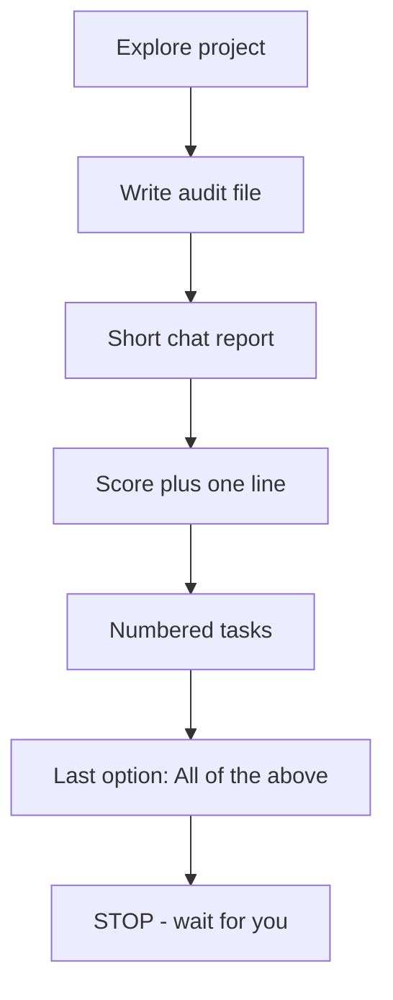
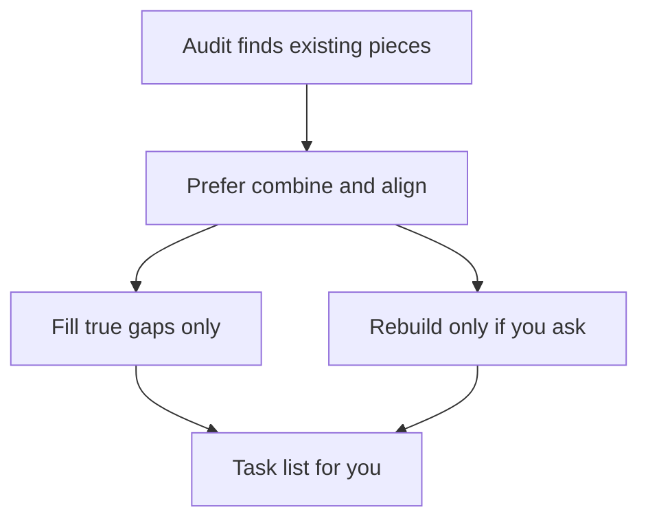
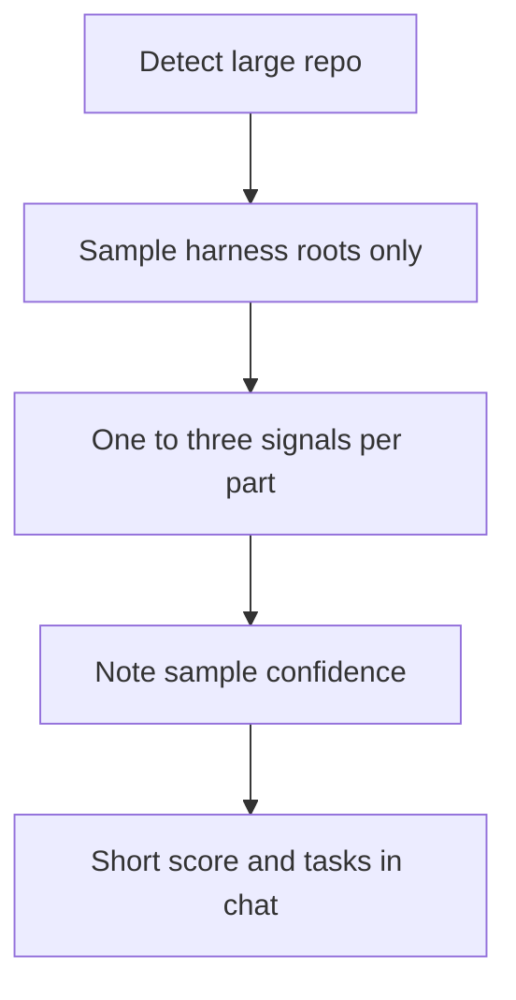
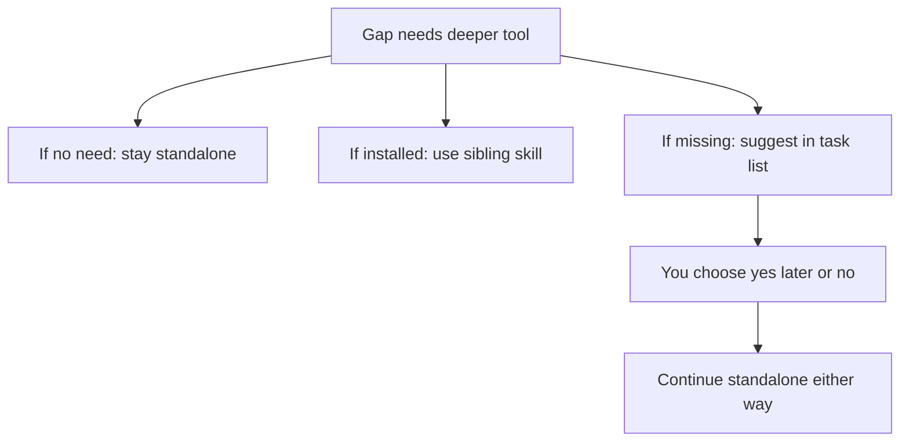

# DIY Harness


A skill that helps you **set up a harness on your own project** so coding agents stop reinventing layout, tokens, and ship steps every session.

It looks at what you already have, scores harness readiness, gives you a short task list, and only builds what you pick. It does not copy [madhurimaram.com](https://madhurimaram.com) onto your folders.

**Status:** In the [iruhdam1/skills](https://github.com/iruhdam1/skills) pack. Readiness scoring is experimental — a starting point, not a grade of you or your brand.

Companion page: [madhurimaram.com/harness](https://madhurimaram.com/harness#harness-setup)

---

## Who it’s for / not for

**For you if:**

- You’re a designer (or designer-builder) shipping a site or app with coding agents
- Tokens, layout, or deploy steps keep drifting across chats
- You want a repeatable path: Source → Bake → Proof → Shared system → Ship

**Not for you if:**

- You only need a one-off page tweak
- You want someone to paste another site’s folder names onto yours
- You’re looking for a multi-hour multi-agent app factory (different problem — see the essay notes)

---

## How long it takes

No fake minute counts. Model and project size vary.

| Pass | What happens |
| --- | --- |
| **Turn A** (first reply) | Audit doc + readiness score + numbered task list. **Nothing installs.** |
| **Turn B** (after you pick) | Only the tasks you chose → verify → stop |
| **Weekly** (later) | Drift check-in. You approve before fixes |

First pass is usually one working session for audit + plan. Setup is the next step. Large repos take longer; Carrd / CMS-only is shorter.

---

## The full loop




---

## Turn A report (what you see in chat)




Chat looks like this:

```
1) Readiness: 0.XX — Scattered | Forming | Organized
   One sentence why.

2) Tasks (pick what to do next):
   [1] …
   [2] …
   [3] …
   [N] All of the above

3) Stop. Wait for numbers or All.
```

Detail lives in an audit file (`docs/harness-audit.md` or a dated notes file) — not a wall of text in chat.

---

## Combine vs rebuild




If you already have tokens, sync, lint, or CI, the skill looks for those first and offers to **align** them — not invent a second system beside them. Rebuild only if you explicitly ask.

---

## Huge repos




On a large monorepo it samples harness-related roots (content, docs, tokens, scripts, CI, deploy). It does not dump the whole tree into chat. Confidence may say “based on a sample.” You can ask for a deeper look at one package next.

---

## Optional sibling skills




**diy-harness stands alone.** You do not need [design-lint](https://github.com/iruhdam1/skills/tree/main/skills/design-lint), [bake-the-brief](https://github.com/iruhdam1/skills/tree/main/skills/bake-the-brief), or [responsive-preview](https://github.com/iruhdam1/skills/tree/main/skills/responsive-preview). If a gap would clearly benefit later, the task list may *suggest* adding one. Never required. Never blocks.

---

## What you’ll get

1. An **audit file** — inventory, existing pieces, Present/Partial/Missing, score, gaps
2. A **short chat report** — score + numbered tasks + stop
3. After you pick — **setup for those tasks only**, then a light verify pass

---

## How to run

When published in the pack:

```bash
npx skills@latest add iruhdam1/skills
```

Then in your agent tool:

```
/diy-harness
```

Or say: “setup my harness”, “audit harness readiness”, “DIY harness”.

**Model tip:** Use a capable agentic model with file tools for Turn A (same class as multi-file refactors). Turn B can stay or drop one tier once tasks are chosen. Tiny chat-only models skip steps and invent folders — avoid those for Turn A.

Companion page: [madhurimaram.com/harness](https://madhurimaram.com/harness#harness-setup) — **Copy skill** pastes the same agent prompt if you want it without installing.

---

## FAQ

### How long does one request take?

Turn A is audit + score + task list — not a full install. Setup is Turn B after you pick. Large repos take longer; no fake SLA.

### Will it install things without asking?

No. Nothing installs until you pick task numbers or **All of the above**.

### Do I need design-lint / bake-the-brief?

No. Standalone by default. If you already have them, it points there. If not, it may suggest one later in the task list.

### I already have tokens / lint / CI — will it rebuild everything?

Default is **combine / align**. Fill gaps only. Rebuild only if you ask.

### My repo is huge — what happens?

It samples for harness signals, notes confidence, keeps chat short. It may ask which package is in scope. “All of the above” on a huge repo is expensive on purpose — it may warn once.

### What does the readiness score mean? Is it a grade?

Harness readiness from 0–1 across six parts (prior map, Source, Bake, Proof, Shared system, Ship). Bands: Scattered / Forming / Organized. **Experimental.** Not a grade of you or your brand.

### Which model should I use?

Capable agentic model with tools for Turn A. Optional tip only — the skill does not switch models for you.

### What if the agent skips steps?

The skill requires a phase checklist every reply and hard-stops Setup before you pick tasks. If it starts Setup early, stop it and ask it to re-emit the score + task list.

### Can I pick only some tasks? What is “All of the above”?

Yes — reply with numbers like `1` or `1,3`. Last option runs every listed task. More tasks = more work (and tokens) on purpose.

### Carrd / Framer / no Git — does this work?

Yes. Audit still writes a doc + score. Setup proposes lightweight docs and checklists — not fake `scripts/` folders.

### Where do I send feedback or a confusing result?

See **Feedback & questions** below.

---

## Evals (summary)

Maintainers use a 12-point rubric and four fixture shapes before calling the skill ready. Full detail: [`EVALS.md`](EVALS.md).

Quick bar for “ready”:

- Score → numbered tasks → All of the above → STOP
- No Setup before you pick
- Chat stays short; detail in the audit file
- Standalone works without sibling skills
- Combine/align when pieces already exist
- Huge repos sample; no tree dump in chat

Skills-repo publish stays gated until fixtures pass.

---

## Feedback & questions

Open an issue: [github.com/iruhdam1/skills/issues](https://github.com/iruhdam1/skills/issues)

Title with `[diy-harness]` and paste:

- Readiness score (and band)
- Tasks shown
- What you expected
- Tool + model used

Questions welcome — if this FAQ didn’t cover it, open an issue so we can add it.

---

## Changelog / experimental

- Readiness model (weights, bands, labels) is a starting point — evolve per project
- Agent prompt lives in `SKILL.md` (this pack); website mirrors it for Copy skill
- This README is for humans; keep the agent prompt lean

### Glossary (short)

| Term | Plain meaning |
| --- | --- |
| Harness | Rules + checks so agents build inside a path you chose |
| Source | Editable truth (markdown, tokens, CMS) |
| Bake | Sync/build from source → live |
| Proof | Checks that can fail ship |
| Shared system | Written contracts for humans + agents |
| Ship | One clear publish path |
| Turn A / Turn B | Audit+plan first; setup only after you pick |
