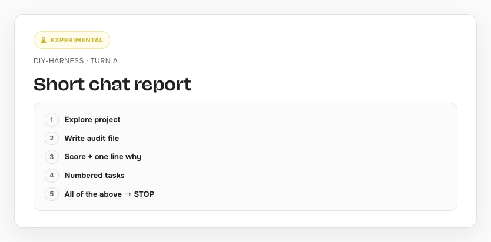
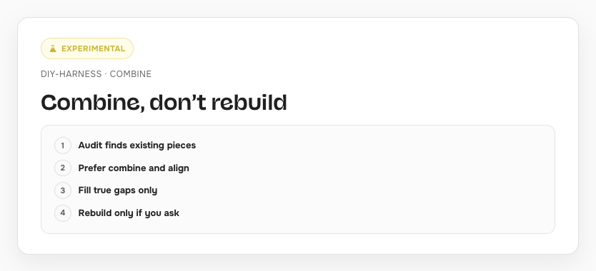
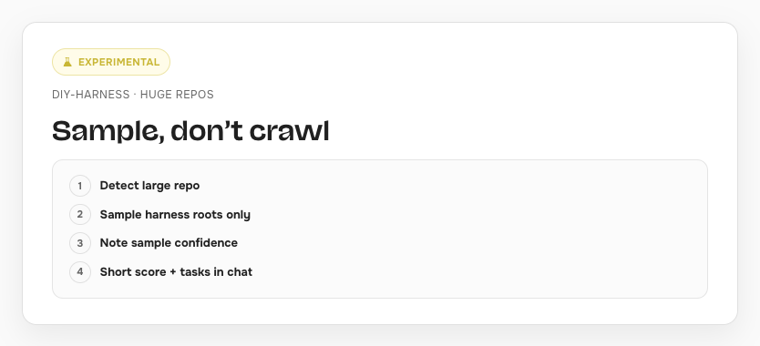
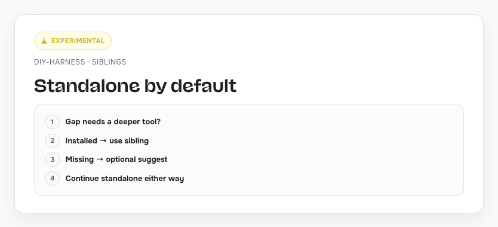

# DIY Harness


A skill that helps you **set up a harness on your own project** so coding agents stop reinventing layout, tokens, and ship steps every session.

It looks at what you already have, scores harness readiness, gives you a short task list, and only builds what you pick. It does not copy [madhurimaram.com](https://madhurimaram.com) onto your folders.

**Experimental** — readiness score and bands are a starting point, not a grade of you or your brand.

Companion: [madhurimaram.com/harness](https://madhurimaram.com/harness#harness-setup)

---

## Who it’s for / not for

**For you if:** designer or designer-builder shipping with coding agents; tokens/layout/deploy keep drifting; you want Source → Bake → Proof → Shared system → Ship.

**Not for you if:** one-off tweak; you want another site’s folder names pasted on; multi-agent app factory (different problem).

---

## How long it takes

| Pass | What happens |
| --- | --- |
| **Turn A** | Audit doc + readiness score + numbered task list. **Nothing installs.** |
| **Turn B** | Only the tasks you chose → verify → stop |
| **Weekly** | Drift check-in. You approve before fixes |

No fake minute counts. Large repos take longer; Carrd / CMS-only is shorter.

---

## Readiness bands (0–1)

| Score | Band | What happens next |
| --- | --- | --- |
| 0.00–0.33 | Scattered | Foundations first |
| 0.34–0.66 | Forming | Fill Proof, Bake, Ship gaps |
| 0.67–1.00 | Organized | Do not rebuild — thin gaps + weekly |

---

## Diagrams










Editable Mermaid sources (for maintainers): `visuals/*.mmd`. PNGs are baked with the website shot-card pipeline (Onest).

---

## What you’ll get

1. An **audit file** — inventory, existing pieces, score, gaps
2. A **short chat report** — score + numbered tasks + stop
3. After you pick — **setup for those tasks only**, then a light verify

Chat shape:

```
1) Readiness: 0.XX — Scattered | Forming | Organized
   One sentence why.

2) Tasks (pick what to do next):
   [1] …
   [N] All of the above

3) Stop. Wait for numbers or All.
```

---

## How to run

```bash
npx skills@latest add iruhdam1/skills
```

Then `/diy-harness` — or say “setup my harness”, “audit harness readiness”, “DIY harness”.

**Model tip:** capable agentic model with file tools for Turn A. Tiny chat-only models skip steps — avoid those for Turn A.

On the companion page, **Copy skill** pastes the same agent prompt without installing.

---

## FAQ

### Will it install things without asking?

No. Nothing installs until you pick task numbers or **All of the above**.

### What does the readiness score mean? Is it a grade?

See **Readiness bands** above. Six parts: prior map, Source, Bake, Proof, Shared system, Ship. **Experimental.** Not a grade of you or your brand.

### What if the agent skips steps?

Ask it to re-emit the score + task list. The skill hard-stops Setup before you pick.

### Carrd / Framer / no Git — does this work?

Yes. Audit still writes a doc + score. Setup proposes lightweight docs and checklists — not fake `scripts/` folders.

### Where do I send feedback?

[github.com/iruhdam1/skills/issues](https://github.com/iruhdam1/skills/issues) — title with `[diy-harness]`; include score (and band), tasks shown, what you expected, tool + model.

---

## Evals

Maintainers use a 12-point rubric and four fixtures — see [`EVALS.md`](EVALS.md).

Quick bar: score → tasks → All → STOP; no Setup before pick; short chat; standalone; combine/align; huge repos sample.

---

## Glossary

| Term | Plain meaning |
| --- | --- |
| Harness | Rules + checks so agents build inside a path you chose |
| Source | Editable truth (markdown, tokens, CMS) |
| Bake | Sync/build from source → live |
| Proof | Checks that can fail ship |
| Shared system | Written contracts for humans + agents |
| Ship | One clear publish path |
| Turn A / Turn B | Audit+plan first; setup only after you pick |
