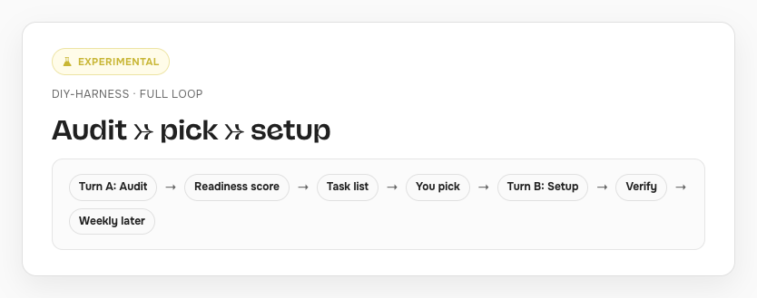

# DIY Harness



Help the human **set up a harness on their own project** — not a copy of [madhurimaram.com](https://madhurimaram.com).

**Pain:** Agents reinvent layout, tokens, and ship steps every session — or invent structure without looking at what already exists.

**Install once** in agent tooling; **run per project** when starting or re-auditing.

**Experimental:** readiness score and bands are a starting point, not a grade of the human or the brand.

**Opening line (Turn A):** “I’ll give you a readiness score and a short task list to pick from. Nothing installs until you choose.”

## Readiness bands (0–1)

| Score | Band | What you do |
| --- | --- | --- |
| 0.00–0.33 | Scattered | Foundations first (Source + light Shared system); short task list |
| 0.34–0.66 | Forming | Fill Proof + Bake + Ship gaps; tighten contracts |
| 0.67–1.00 | Organized | **Do not rebuild.** Weekly drift + thin gaps only |

## Usage

```
/diy-harness
```

Or: “setup my harness”, “audit harness readiness”, “DIY harness”.

## When to use / not

**Use when:** starting agentic work on a site/app; tokens/layout/ship steps drift; project is messy *or* already Organized (do not rebuild Organized projects).

**Skip when:** one-off page tweak; they want madhurimaram.com folder names copied; full redesign / greenfield product build.

## Pace

| Turn | Scope | Stop when |
| --- | --- | --- |
| **A** | Explore → audit file → short chat report (score → tasks → stop) | Human has not picked. **No Setup.** |
| **B** | Chosen tasks → verify → stop | Chosen gaps done + verified |
| **Weekly** | Later invoke | Drift report awaiting approval |

No fake wall-clock SLA. Large repos take longer; CMS / Carrd shorter.

## Chat report (Turn A — required)

```
1) Readiness: 0.XX — Scattered | Forming | Organized
   One sentence why.

2) Tasks (pick what to do next):
   [1] …
   [2] …
   [N] All of the above

3) Stop. Wait for numbers or All.
```

Rules: score first → numbered tasks → **All of the above** last → **STOP**. Detail in the **audit file**, not chat. No full tree / essay in the reply.

## Phase checklist + hard stops

End every reply with:

```
Phase: Audit | Score | Plan | Setup | Weekly
Done: …
Blocked: …
```

Skipping a phase = stop and go back.

- **No Setup** before they pick numbers (or **All of the above**)
- **No** inventing folders/contracts before the audit file exists
- **No** deleting existing work; **no** inventing `.env` / API keys / deploy tokens
- If Setup started in Turn A: stop, re-emit score + tasks, wait

## Tokens and models

**This skill does not route models.** Host picks the model. Prefer a capable agentic model with repo tools for Turn A; Turn B may drop one tier. Avoid tiny chat-only / no-tools models for Turn A.

Burns tokens: wide crawls, tree dumps, Setup in the same turn as Audit. Keeps cost down: short report, audit file, scoped Turn B. “All of the above” costs more on purpose.

## Operating posture

- **Standalone by default** — zero sibling skills required
- **Look first** — never invent before the audit doc
- **Combine / align** existing pieces — do not rebuild a parallel system
- **Approve before write** — nothing installs until they pick tasks

Optional siblings (`design-lint`, `bake-the-brief`, `responsive-preview`): use if installed; at most one suggest in the task list; never require, refuse, or auto-install.

## Huge-repo dial

If many packages, `apps/`+`packages/`, 10k+ files, or explore is slow:

1. Say: “Large repo — I’ll sample for harness signals, not crawl everything.”
2. Prefer roots: `content/`, `docs/`, tokens/styles, `scripts`/`package.json`, CI, deploy configs
3. Per part: 1–3 signals → Present / Partial / Missing (unclear → Partial)
4. Monorepos: ask once (or infer) which package is in scope
5. Chat stays tiny; evidence in audit file; note sample confidence
6. Warn once before **All** on a huge repo

## Instructions

### 1. Audit — write a doc

Explore the project (repo, CMS, Carrd, or mixed). Write/update `docs/harness-audit.md` or `notes/harness-audit-YYYY-MM-DD.md`.

Must include: inventory; existing harness-like pieces (map to Source / Bake / Proof / Shared / Ship); Present / Partial / Missing per part; readiness `0.0–1.0` + evidence; sample confidence if large; gaps only.

```md
# Harness audit — [project] — [YYYY-MM-DD]

## Inventory
- Surfaces / editable source / deploy / checks: …

## Existing harness-like pieces
- … → Source / Bake / Proof / Shared / Ship

## Harness parts
| Part | Status | Evidence |
| --- | --- | --- |
| Prior map / audit | … | … |
| Source | … | … |
| Bake | … | … |
| Proof | … | … |
| Shared system | … | … |
| Ship | … | … |

## Readiness
Score: 0.XX — Scattered | Forming | Organized
Evidence: …
Confidence: full look | sample of …

## Gaps only (next)
- …
```

### 2. Score (0–1)

Six equal weights (~0.167). Partial = half credit.

| Part | Present means roughly… |
| --- | --- |
| Prior map / audit | Inventory or system map exists (this run creates/updates it) |
| Source | Editable truth (content/, CMS, tokens — not only live HTML) |
| Bake | Sync/build source → live |
| Proof | Lint/audits/gates that can fail ship |
| Shared system | Written contracts agents + humans share |
| Ship | One clear checked publish path |

**First-run rule:** Prior map created *this turn* is at most **Partial**, never Present. Apply **Readiness bands** above for what to do next.

### 3. Plan — numbered tasks

Only Missing / Partial become tasks. Default = **combine / align**. Rebuild only if they ask. Overlapping systems → list both; human chooses survivor before Setup. Last task always **All of the above**. Optional once after pick: Human-led / Shared / Agent-led (approval frequency only).

### 4–5. Turn B Setup + verify

Only chosen tasks. CMS / Carrd / no git → lightweight docs + checklists, not fake `scripts/`. Prefer installed siblings when a chosen task needs them. Then light Proof bar (or `design-lint` if installed):

1. Chosen files exist and paths match
2. No obvious token/spacing invent outside the project
3. No secrets created
4. Say what still needs a human eye

Do **not** clone a full CHECKS.md suite here.

### 6. Weekly (later)

Drift report + **ask approval** before fixes. Propose (don’t require) check-in template → `docs/harness-drift.md` with **Awaiting approval**. Never silent-merge.

## When it goes wrong

| Failure | Recovery |
| --- | --- |
| Setup early / skipped Audit or Plan | Stop. Re-emit score + tasks. Wait. |
| Essay or full tree in chat | Move to audit file; re-emit short report |
| Parallel harness beside working sync/lint | Stop. Re-audit. Propose combine/align |
| Refused for missing siblings | Continue standalone; optional suggest only |
| Invented secrets or fake Carrd scripts | Delete invented bits; propose lightweight docs |

## Feedback

https://github.com/iruhdam1/skills/issues — mention once after a successful plan or setup.

---

Companion: [madhurimaram.com/harness](https://madhurimaram.com/harness#harness-setup). Siblings (optional): [design-lint](https://github.com/iruhdam1/skills/tree/main/skills/design-lint), [bake-the-brief](https://github.com/iruhdam1/skills/tree/main/skills/bake-the-brief), [responsive-preview](https://github.com/iruhdam1/skills/tree/main/skills/responsive-preview).
