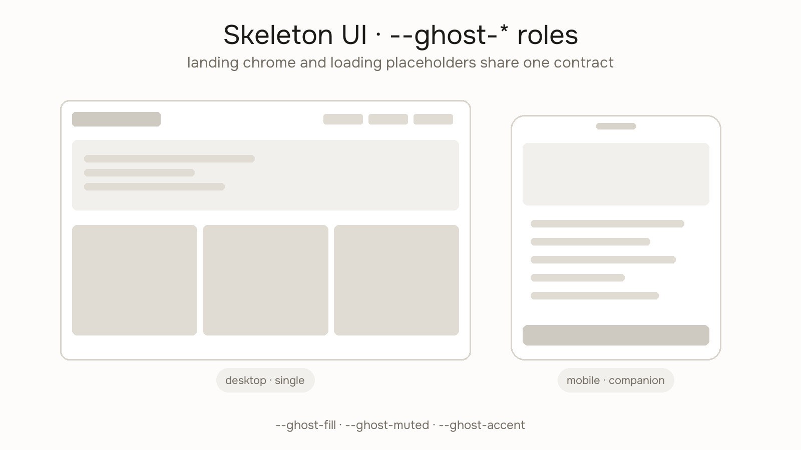

# Ghost Wireframe



Build muted skeleton / ghost UI that reads as product chrome at landing scale and as a loading skeleton for dense lists, tables, and dashboards.

Works with any model (Cursor, Claude, ChatGPT, Gemini, Copilot, etc.).

## Colour roles (export contract)

Always emit these CSS variables:

```css
--ghost-bg
--ghost-surface
--ghost-ink
--ghost-muted
--ghost-accent
--ghost-accent-text
--ghost-fill
--ghost-highlight
```

Prefer `fill="var(--ghost-fill)"` (and siblings) in SVG, or HTML blocks that reference the same variables.

## Jobs

### Generate

1. Ask (or infer): **view** — `single` (one device) or `combo` (desktop + mobile side by side)
2. If single: **device** — `desktop` or `mobile`
3. Pick a layout family: Dashboard, Analytics, Kanban, CRM table, Settings (each has desktop + mobile companions)
4. Apply a Happy Hues–style role palette (or tokens from the pack’s `DESIGN.md`)
5. Output **HTML snippet** and/or **SVG** with muted bars/blocks, kept layout, no interactive widgets
   - Single → one framed ghost
   - Combo → one artboard with desktop + mobile + gap, shared `--ghost-*` roles
6. Optional generic window (desktop) or phone (mobile) frame — no trademarked bezels

### Drop into template

1. Find the pack’s ghost / product-meet slot
2. Replace inner markup with the generated ghost
3. Wire `--ghost-*` on a wrapper so the hand-built default and tool/skill exports are interchangeable

### Loading skeleton snippet

Emit a compact HTML/CSS block suitable for in-product loading placeholders (lists, tables, cards) using the same roles.

## Visual rules

- Muted bars and rounded blocks; keep hierarchy
- Readable as “product” at marketing scale; also valid as loading UI
- Do not invent a real interactive app or clone UI Generator / Figma Ghost assets
- No attribution required on exports

## Compact paste prompt

```
Use Tiny Design Shop ghost-wireframe: generate skeleton/ghost UI for landing chrome or loading states. View single|combo. If single: device desktop|mobile. Layout families: Dashboard/Analytics/Kanban/CRM/Settings (each has desktop+mobile). Use CSS vars --ghost-bg --ghost-surface --ghost-ink --ghost-muted --ghost-accent --ghost-accent-text --ghost-fill --ghost-highlight. Output HTML/SVG with muted bars/blocks; keep layout. Combo = side-by-side artboard. Drop into template ghost slot when asked.
```

Also in `compact-prompt.txt` beside this skill.

## Live tool

- Generator: https://tinydesignshop.com/tools/ghost-wireframe-generator
- Skill page (copy/download): https://tinydesignshop.com/skills/ghost-wireframe

Browser tool for layout pick + Single/Combo view + palette + PNG/SVG/HTML export. SVG convert and Copy to Figma are later phases — do not assume they exist in the skill.

## Install once

```bash
npx skills@latest add iruhdam1/skills
```

Pack folder: https://github.com/iruhdam1/skills/tree/main/skills/ghost-wireframe
