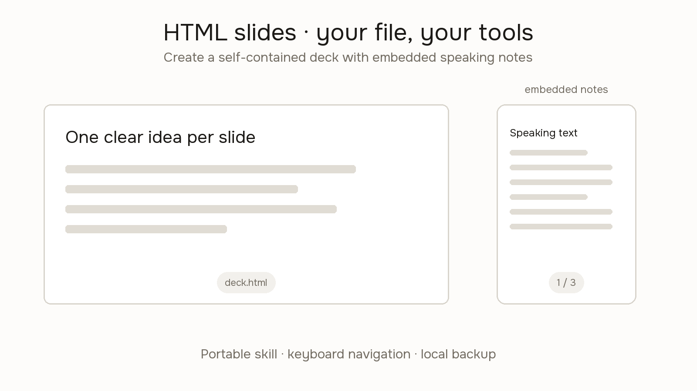

# HTML Slide Presenter

Create a downloadable HTML presentation from the user's content, or adapt an existing HTML deck for the free [HTML Slide Presenter](https://tinydesignshop.com/tools/html-slide-presenter). Creating the file does not require a particular paid model, API, or presentation service; the user's chosen AI client has its own access and usage limits.

## Make the deck

1. Use the supplied audience, purpose, duration, content, and style. Ask only for missing information that materially changes the presentation. Label assumptions and placeholders; do not invent quotations, results, credentials, or evidence.
2. For a new deck, adapt `starter.html` or study `example.html`. For an existing deck, preserve its content, styling, navigation, and notes unless the user requests changes. Explain incompatibilities before replacing an established deck structure.
3. Read [references/format.md](references/format.md) for the slide and notes contract. Deliver one complete HTML document with inline CSS/JavaScript, embedded assets, and no required external files, fonts, libraries, or network requests. Keep it at or below 2,097,152 bytes.
4. Use a clear active slide, keyboard previous/next/Home navigation, and notes stored inside their corresponding slide. JSON notes support `title`, `script`, and a string-array `notes`; plain-text `aside.notes` is also supported. Never put speaking notes on the audience screen.
5. Keep slide text concise, high-contrast, and readable at presentation size. Use the user's requested visual style rather than imposing Tiny Design Shop branding. Adapt layout to available space without reducing text to unreadable sizes.

## Verify and hand off

- Release status (2026-09-30): this pack is available before the website's phone-notes update. Create embedded notes now, but do not promise the deployed presenter will display them until that update is published. Keep separate backup notes in the meantime.
- Run `node scripts/validate-deck.mjs /path/to/deck.html` when a Node runtime is available. It checks structure, size, dependencies, and notes; it does not execute the deck or prove compatibility.
- When browser access is available, open the file, disable networking, and test every slide using both keyboard and visible controls. Check layout at the intended presentation size and a smaller laptop viewport. Test the uploaded presentation and phone notes only when the user has authorized that upload.
- Distinguish completed static checks, completed browser checks, and checks unavailable in the current environment. Do not say the deck or AI-client integration was tested when it was not.
- Return the downloadable file and a short description of how to open it locally. Link to [HTML Slide Presenter](https://tinydesignshop.com/tools/html-slide-presenter): the user selects the file, completes bot verification, chooses expiry, opens the presenter, and connects their phone.
- Do not upload automatically, bypass bot verification, claim a live session exists, or imply permanent hosting. The file is uploaded temporarily when the user uses the presenter. Phone controls/notes require internet; the local file is a keyboard-controlled backup.
- Notes are embedded in the file, not confidential storage. Anyone with the file can inspect them. Do not include private notes unless the user intends to share the file with them included.

## Client usage

This is a portable instruction pack. A skill-capable coding agent can read this folder using its documented skill mechanism; a regular chat can use `compact-prompt.txt`. Do not claim that ordinary ChatGPT chats natively install skills or that a particular paid client feature is required. If the client cannot create attachments, provide complete HTML source and instructions to save it as a UTF-8 `.html` file; never provide a truncated fragment as a finished deck.
