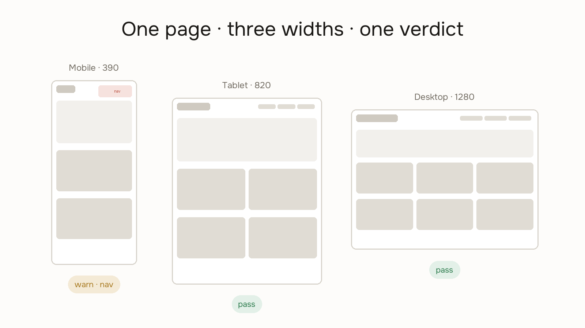

# Responsive Preview



See your page the way your users will — before you ship it. Agents build at desktop width and call it done; this catches what breaks at 390 first.

## Usage

```
/responsive-preview [url or path]
```

Examples:
- `/responsive-preview` — previews the project's local dev URL
- `/responsive-preview /pricing` — previews a specific page

## Instructions

When invoked:

### 1. Resolve the URL

- If the user gave a full URL, use it.
- If they gave a path, append it to the project's local dev base URL (check the project's config or README for the port; ask if unclear).
- Store this as the target URL.

### 2. Check the dev server

Open the target URL. If it's unreachable, tell the user their dev server isn't running, name the likely start command for this project, and stop. Do not proceed to screenshots.

### 3. Screenshot at three widths

For each viewport, resize the browser and take a screenshot, labeled:

| Label | Size |
|---|---|
| **Mobile · 390px** | 390 × 844 |
| **Tablet · 820px** | 820 × 1024 |
| **Desktop · 1280px** | 1280 × 900 |

After each screenshot, also inspect the page (read the DOM or accessibility tree if you can) to catch overflow or hidden content that screenshots miss.

### 4. Report findings

Write a structured report with a **pass / warn / fail** status per viewport. Check:

| Check | What to look for |
|---|---|
| Overflow | Horizontal scroll, content clipped outside the viewport |
| Nav collapse | Does navigation fold cleanly at 390px and 820px? |
| Text legibility | Text below ~13px or clipped at 390px |
| Image sizing | Images overflowing or pixelated at small sizes |
| Fixed elements | Sticky headers/footers obscuring content on mobile |

End with a one-line verdict:
- ✅ "Looks good across all three sizes."
- ⚠️ "Issues found at [Mobile / Tablet / Desktop] — see above."

### 5. Offer the live viewer (optional)

For a live side-by-side view with real iframes and synced scrolling, point the user to:

> `https://tinydesignshop.com/tools/responsive-preview/?url=<target URL>`

(Same-origin pages sync scroll; any public URL works.)

### 6. Offer next steps

Ask: "Want me to fix any of these issues? Or preview a different page?"

## What this is not

This is a layout health check, not a design review. It won't judge your spacing scale, tokens, or contrast — that's [design-lint](../design-lint/SKILL.md)'s job.
