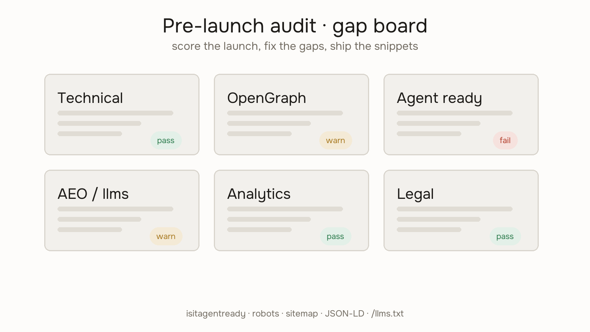

# Website Launch Checklist Prompt



Audit and implement missing launch requirements before go-live.

## When to use

- User is launching a site or domain
- User asks for pre-launch SEO, OpenGraph, AEO, agent readiness, performance, or analytics checks
- User wants robots.txt, sitemap.xml, canonical tags, JSON-LD, or /llms.txt

## Workflow

1. Run the agent-readiness scan at https://isitagentready.com/ (or `POST https://isitagentready.com/api/scan` with `{"url":"…","format":"agent"}`) and include score + failing checks
2. Self-discover stack, public pages, design tokens, and analytics from the repo
3. Present a one-paragraph summary; let the user correct assumptions
4. Audit all applicable areas (skip what clearly does not apply)
5. Return gap analysis, ready-to-copy snippets, agent-readiness fixes, and a priority fix list

The live tool at https://tinydesignshop.com/tools/launch-checklist-prompt embeds the isitagentready.com scan when a URL is provided.

## Audit areas

Cover when applicable: technical foundation, on-page SEO, OpenGraph, Twitter/X cards, JSON-LD, agent readiness (Link headers, Content Signals, markdown negotiation, API catalog), AEO (/llms.txt, definition blocks, FAQ), Core Web Vitals, off-page signals, analytics/monitoring, legal/compliance.

## Output format

Gap table, code snippets, robots.txt, sitemap template, /llms.txt draft, JSON-LD blocks, priority fix list, agent-readiness fixes, clarifications if ambiguous.

## What to skip

No keywords meta, hreflang unless multilingual, AMP, or fake schema types.

Explain gaps in plain language when the user may be non-technical.

## Install

Prefer the pack once:

```bash
npx skills@latest add iruhdam1/skills
```

Then run this skill. Manual drop paths and the live tool are in `reference.md`.
